# OasisPro

## Status of OasisPro

Not completed. We need to finish the database integration as well as the logic of the program as of November 19, 2022.

## Progress report

Notice: The ${\color{red}readme.md}$ file will be continuously updated throughout the life cycle of this project. 

| Task             | Status        | Lead                  | Collaborators | Expected end date | Actual end date | Time spent | Notes |
| ---------------- | ------------- | --------------------- | ------------- | ----------------- | --------------- | ---------- | ----- |
| Readme.md        | In Progress   | Andre Nonaka Cordova  | Content Cell  | ----------------- | --------------- | ---------- | ----- |
| Use Case Model, OO Design Model,  and Traceability Matrix  | Content Cell  | Content Cell  | Content Cell  | ----------------- | --------------- | ---------- | ----- |

## How to work on this project in your personal computer

To begin, we have to make sure that you have installed git in your virtual machine. To check this, go to gnome-terminal and type git --version as seen in the picture below. Make sure that you receive a version for your git and not an error. 

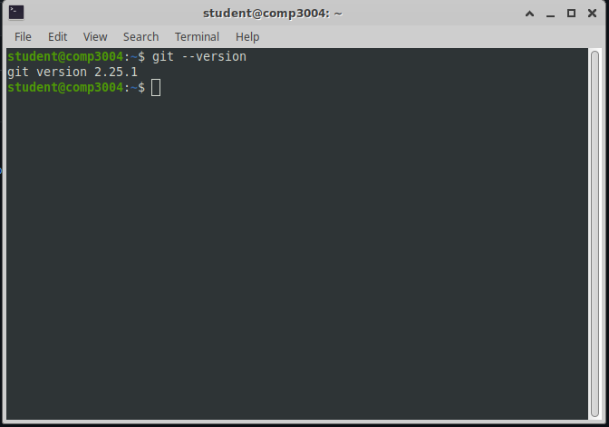

After this, we will need to create a local repository that store a clone of the project somewhere in your computer. In my workspace, I created mine in my desktop as seen in the image below (circled in blue). 

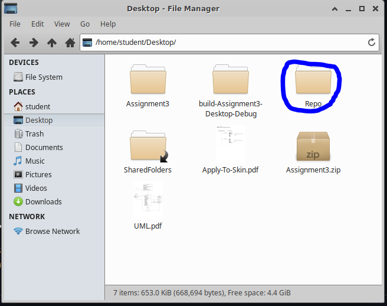

After this go to the directory of that folder as seen in the image below. 

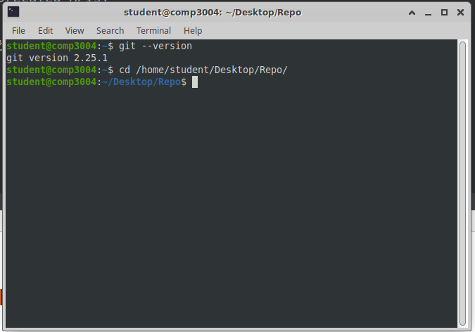

After this clone this repository by using the git clone command followed by this link: https://github.com/Andre-Nonaka/OasisPro.git as seen in the image below. 

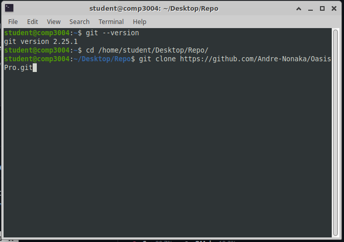

After running the above command, you will be asked to enter your username and password. For your username, it is the username of your github account, while the password is the personal access token you will need generate from Github by going to your settings and selecting developer settings followed by personal access tokens as seen in the images below (follow the steps outlined in the images below).

Step 1
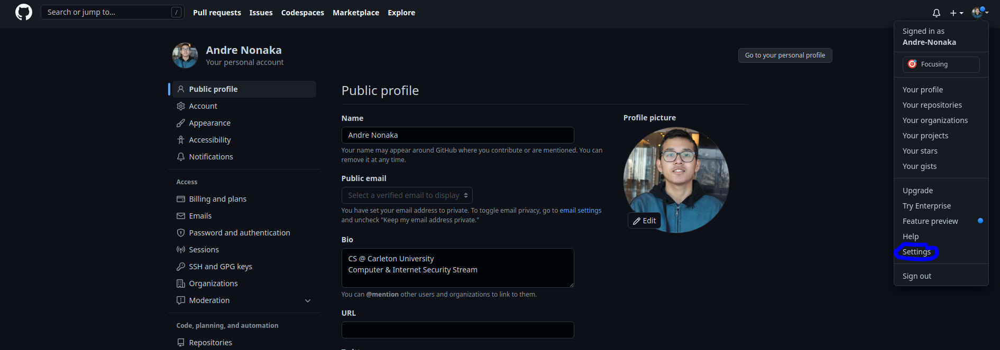

Step 2
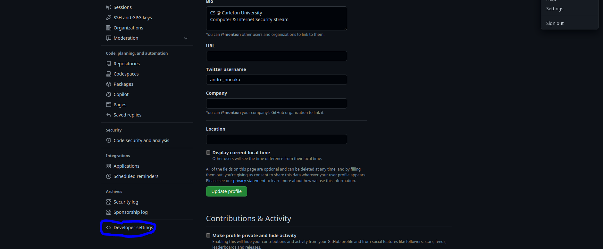

Step 3
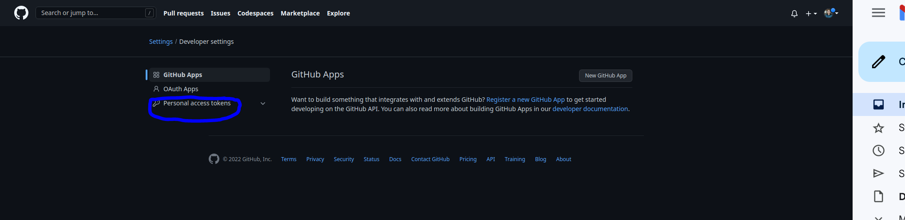

Step 4
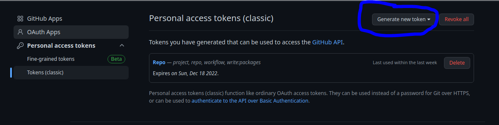

Step 5
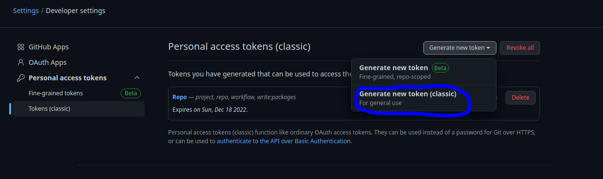

Step 6
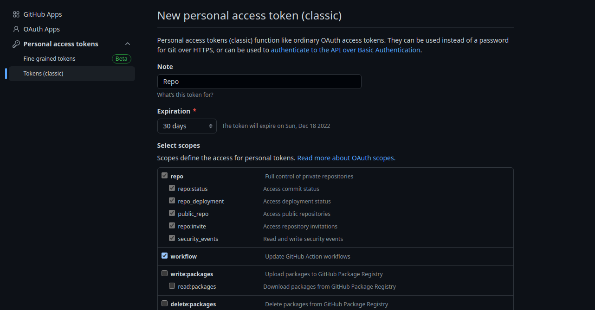

Step 7
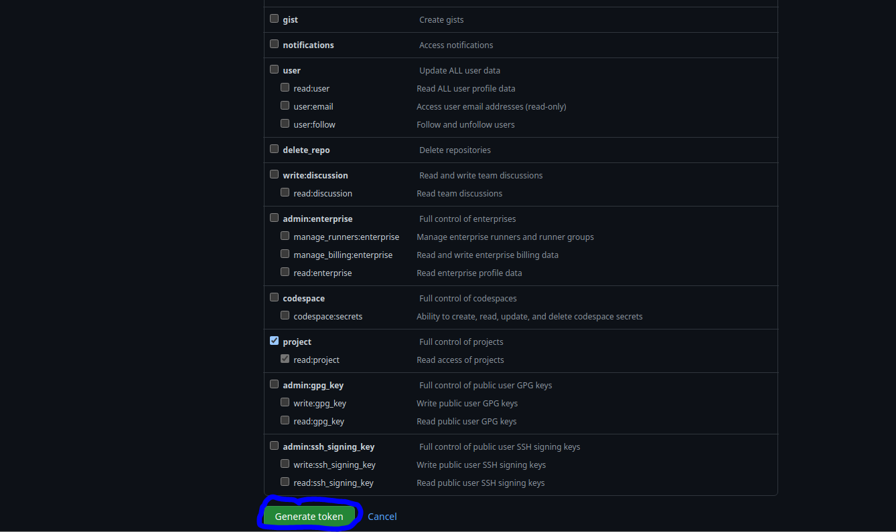

Once you have generated your personal access token, copy and paste it into the gnome-terminal for your password. After processing your login information, the clone of the repository should be added to your repository folder in your personal computer (or virtual machine). You can check if you have OasisPro folder in your repo by typing ls in gnome-terminal as seen in the image below. 

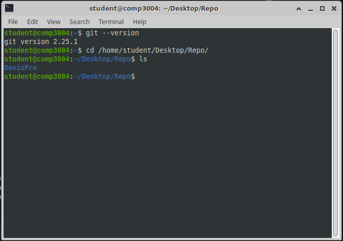

To check if your initial commit was made (this commit would be the cloning of the repository), type git log in gnome-terminal as seen in the image below. 

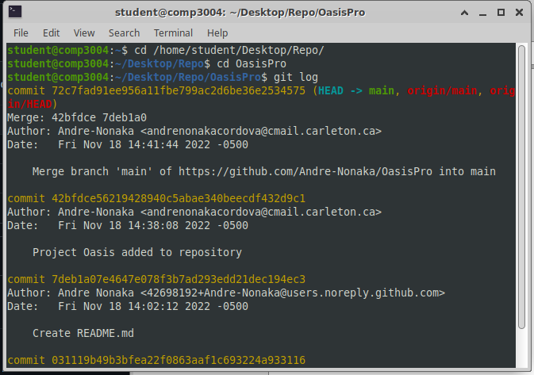

Now that we have finished and confirmed that we cloned our repository, we will need to ensure that our Qt Creator application is configured to push, pull, and commit files to the local and remote repository. First we will open the project from the repository into the Qt Creator application as seen in the image below.

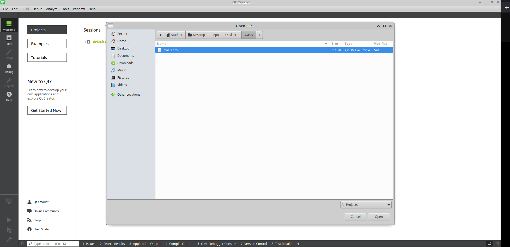

After opening the project in Qt Creator, we will need to check if the project has the path for the git binary file configure in it. To check this, go to the Tools tab and select the Options tab. From there go to the Version Control section and check the Configuration path. If it is empty please enter the path to where the git binary file is stored at within your personal computer or virtual machine as seen in the image below. 

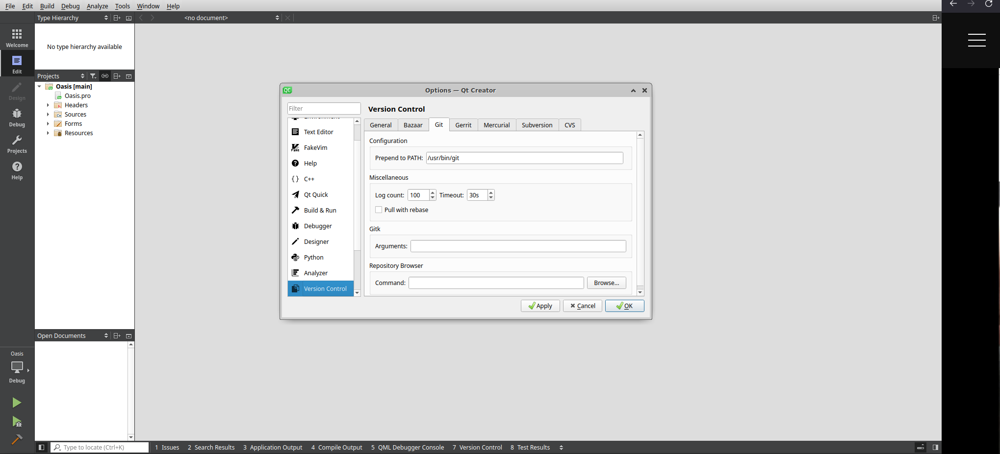

After this, you will be able to push, commit, and pull the files to the local and remote repository. Once you have finish editing the project, it will be time to commit your changes to the repository. To do this, we will need to type in gnome-terminal git commit -m "Put whatever you want here" as seen in the image below. 

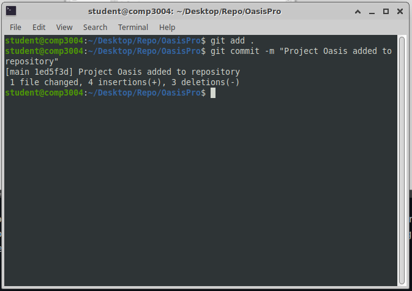

After doing this, we will pull from the repository any new updated or added files using git pull as seen in the images below (remember that your password is the personal access token you created in your Github account and not your actual password).

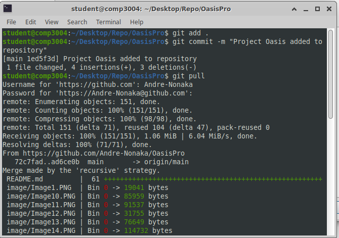

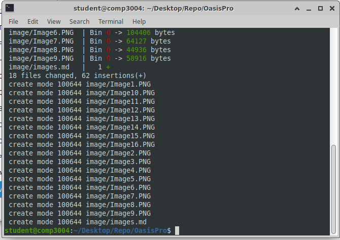

After pulling the files, you will be able to push your newly created commit to the repository using git push origin main as seen in the image below (remember that your password is the personal access token you created in your Github account and not your actual password).

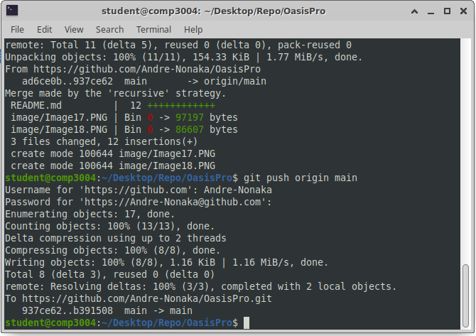

Using these instructions, you will now be able to fully update and push your changes to the project without any issues. 
