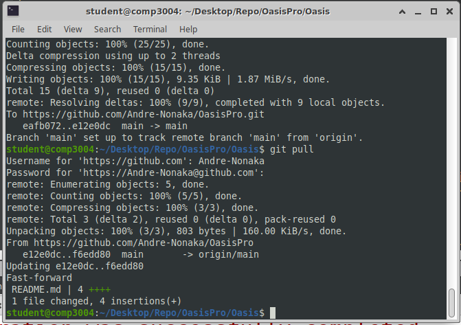
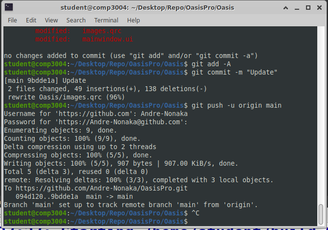

# OasisPro

## Important Notice (Part 1)

Please make sure to `comment your code` so that we can understand it as well as be able to debug it properly. This will also help us in explaining our code to our TA.

## Important Notice (Part 2)

To get the most updated version of the project, please type in gnome-terminal in the folder that you created as the repo for the project the following command: `git pull` as seen in the picture below. 



## Timeframe

Some details on the important dates for this project. 

| Date(s)              | Importance            |
| -------------------- | --------------------- |
| December 5, 2022     | Finished all project  |
| December 6 to 9, 2022 | Review project <br>Fix bugs<br>Meet with TA |

## Merge Errors

If you get errors with a merge, please follow the intructions in this [link](https://stackoverflow.com/questions/161813/how-do-i-resolve-merge-conflicts-in-a-git-repository) and use BA (Base) for when merging changes with the `mergetool`. 

## Important files

Please download, review, and read the following necessary files (the specification document will be added after consultation with the client) provided to us by our customer (client): 

[Download OASIS_Pro_Manual_v1r8.pdf](client/OASIS_Pro_Manual_v1r8.pdf)

## Client Demo Video

Click on the image below to watch the Oasis Pro demo video (this project will be partly based on this). 
<br>
<br>
[](https://www.youtube.com/watch?v=PDgN03Fx6fg&t=2s)

## Team Number

```diff
Our team number is 37. 
```

## Milestones & Package Releases

Each milestone in this project will bring a package release showcasing what we have completed so far in this project. 

This project has 5 milestones (necessary), which are: 

- [ ] Power which has `Turn On/Turn Off` and `Ending A Session` features as described on page 4 of the manual.
- [ ] Battery level as described in section on page 5 of the manual. 
- [ ] Selecting a session as per `Selecting A Session` on page 5 of the manual.
- [ ] Connection test as per `Connection Test` on page 6 of the manual.
- [ ] Intensity as per `Adjusting Intensity` on page 7 of the manual.

This project also has 2 additional milestones, which are: 

- [ ] `Record feature` where users can choose to record a therapy and add to treatment history.
- [ ] `Replay feature` where users can replay selected treatments from history of treatments.

## Tasks Assignment

| Team Members         | Tasks                 |
| -------------------- | --------------------- |
| Andre Nonaka Cordova | Readme.md<br>GUI Creation<br>Use Case Model<br>OO Design Model<br>Traceability Matrix<br>Program Logic |
| Alex Nedev | Session Selection Feature<br>Intensity Feature |
| Khaled Farag | Power Feature<br>Battery Level |
| Mingrui Liang | Connection Test Feature<br>Record Therapy Feature |

## Status of OasisPro

Not completed &#10060;. 

## Tested Scenarios

Tested Scenarios as of November 19, 2022:

- [ ] Finishing our GUI application with database integration (SQL).
- [ ] Adding logic to our GUI application.

## Checklist

Checklist as of November 19, 2022:

- [ ] Finishing our GUI application with database integration (SQL).
- [ ] Adding logic to our GUI application.

## Progress Report Table

&#128994; = Completed<br>
&#128993; = In Progress<br>
&#128308; = Not Started

```
Notice 1: The Replay Therapy Feature will need to be assigned ASAP.
Notice 2: The Progress Report Table will need to be updated throughout the project. 
```

| Task             | Status          | Lead                  | Collaborators | Expected end date | Actual end date | Time spent | Notes |
| ---------------- | :-------------: | --------------------- | ------------- | ----------------- | --------------- | ---------- | ----- |
| Readme.md (will be continuously updated)       | 	 &#128993;     | Andre Nonaka Cordova  | N/A           | 2022-11-25        | 2022-11-25      | N/A        | N/A   |
| <br><br><br><br>Use Case Model,<br>OO Design Model,<br> and Traceability Matrix<br><br><br><br> |  &#128993;  | Andre Nonaka Cordova  | Alex Nedev | 2022-11-22 | N/A | N/A | Completed a Preliminary draft of the Use Cases.<br>However, we will most likely change certain cases as we move along in the project.<br> Alex N provided some feedback on Use Cases.<br>Will work back and forth with lead until we believe we’re done. |
| GUI Creation     |   &#128994;     | Andre Nonaka Cordova  | N/A  | 2022-11-14 | 2022-11-19      | 1 week | N/A |
| Power Feature    |   &#128994;     | Khaled Farag          | N/A | 2022-11-30 | 2022-11-30 | 2 weeks | Basic features were completed in <1 weeks; waited for other features to be completed to finish this one. |
| Battery Level    |   &#128994;     | Khaled Farag          | N/A  | 2022-11-30 | 2022-12-05 | 3 weeks | Basic features were completed in <1 weeks; waited for other features to be completed to finish this one. |
| Session Selection Feature |   &#128994;  | Alex Nedev   | Andre Nonaka Cordova  | 2022-11-30 | 2022-11-18      | 1 week | N/A |
| Connection Test Feature |   &#128994;  | Mingrui Liang  | Andre Nonaka Cordova  | 2022-11-30 | 2022-11-18      | 1.5 week | N/A |
| Intensity Feature  |   &#128994;   | Alex Nedev  | Andre Nonaka Cordova   | 2022-11-18 | 2022-11-18      | 1 weeks | N/A |
| Record Therapy Feature (should have support for at least 4 users) |   &#128993;  | Mingrui Liang  | N/A  | 2022-11-30 | 2022-11-19      | N/A | N/A |
| Replay Therapy Feature (should have support for at least 4 users) |   &#128308;  | N/A  | N/A | 2022-11-30               | 2022-11-19      | N/A        | N/A   |

## How to work on this project in your personal computer

To begin, we have to make sure that you have installed git in your virtual machine. To check this, type in gnome-terminal `git --version` as seen in the picture below. Make sure that you receive a version for your git and not an error. 


After this, we will need to create a local repository that store a clone of the project somewhere in your computer. In my workspace, I created mine in my desktop as seen in the image below (circled in blue). 


After this go to the directory of that folder as seen in the image below. 


After this clone this repository by using the `git clone` command followed by this link: https://github.com/Andre-Nonaka/OasisPro.git as seen in the image below. 


After running the above command, you will be asked to enter your username and password. For your username, it is the username of your github account, while the password is the personal access token you will need generate from Github by going to your settings and selecting developer settings followed by personal access tokens as seen in the images below (follow the steps outlined in the images below).

Step 1


Step 2


Step 3


Step 4


Step 5


Step 6


Step 7


Once you have generated your personal access token, copy and paste it into the gnome-terminal for your password. After processing your login information, the clone of the repository should be added to your repository folder in your personal computer (or virtual machine). You can check if you have OasisPro folder in your repo by typing `ls` in gnome-terminal as seen in the image below. 


To check if your initial commit was made (this commit would be the cloning of the repository), type `git log` in gnome-terminal as seen in the image below (mine will have many logs as I have already committed multiple items to the repository, but yours should have only one named `initial commit` if it is your first time working on this repository). 


Now that we have finished and confirmed that we cloned our repository, we will need to ensure that our Qt Creator application is configured to push, pull, and commit files to the local and remote repository. First we will open the project from the repository into the Qt Creator application as seen in the image below.


After opening the project in Qt Creator, we will need to check if the project has the path for the git binary file configure in it. To check this, go to the `Tools tab` and select the `Options tab`. From there go to the `Version Control section` and check the `Configuration` path. If it is empty please enter the path to where the git binary file is stored at within your personal computer or virtual machine as seen in the image below. 


After this, you will be able to push, commit, and pull the files to the local and remote repository. Once you have finish editing the project, it will be time to commit your changes to the repository. To do this, we will need to first add the files to our list of files to commit using `git add -A` or `git add .` as seen in the image below.



After this, type in gnome-terminal `git commit -m "Put whatever you want here"` as seen in the image below. 


After doing this, we will pull from the repository any new updated or added files using `git pull` as seen in the images below (remember that your password is the personal access token you created in your Github account and not your actual password).


After pulling the files, you will be able to push your newly created commit to the repository using `git push origin main` or `git push -u origin main` as seen in the image below (remember that your password is the personal access token you created in your Github account and not your actual password).


Using these instructions, you will now be able to fully update and push your changes to the project without any issues. 
